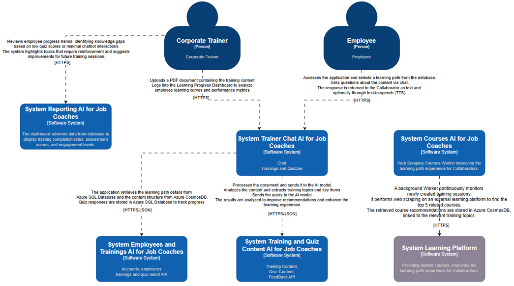
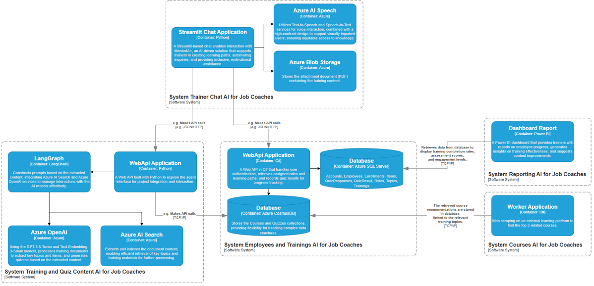

# MentorIA+: Inclusion and accessible learning for career success
<a href="https://youtu.be/jfqNPLSeQU0" target="blank">
	
	Watch in Action
</a>

## Project Description

MentorIA+ is an artificial intelligence solution designed to enhance the work of career coaches by providing an interactive and inclusive support system to facilitate the training and professional development of people with disabilities or barriers to employment. Through an intuitive and accessible conversational interface, MentorIA+ allows coaches to create personalized learning paths, automate routine consultations, and offer motivational assistance.

For employees, MentorIA+ provides an accessible learning experience with voice interaction, high contrast, and adaptability to different needs. Additionally, the system allows for progress assessment through questionnaires and the generation of detailed reports to optimize the learning curve. This not only improves the efficiency of on-the-job training but also ensures ongoing support that reinforces inclusion and equity in employment.

## Key Objectives

1. **Provide accessibility and inclusion in the learning process**: Design a conversational interface with voice support and high contrast, adapted to people with visual impairments.
   
2. **Automate and personalize training**: Generate personalized learning paths from content provided by job coaches.

3. **Monitor and improve the learning process**: Evaluate employees' learning curve through questionnaires and detailed reports for trainers.

## Features

- **Learning Curve Monitoring**: Helps trainers assess each employee's progress and adapt content based on their level of knowledge.
- **Automated consultations and motivational support**: Reduces the administrative burden on job coaches by answering frequently asked questions and providing immediate feedback.
- **Digital Accessibility and Inclusion**: Provides voice interaction and high-contrast design for people with visual impairments, promoting equity in access to knowledge.

## Architecture The C4 model for visualising software architecture

This document describes the architecture of software systems, based on communication.
efficiently and effectively the software architecture, at different levels of detail,
telling different stories to different types of audiences, This will be refined as
Architectural decisions mature and the project moves forward.

### System context diagram

A System Context diagram is a good starting point for diagramming and documenting a software system, allowing you to step back and see the big picture. Draw a diagram showing your system as a box in the centre, surrounded by its users and the other systems that it interacts with.

### Container diagram

The Container diagram shows the high-level shape of the software architecture and how responsibilities are distributed across it. It also shows the major technology choices and how the containers communicate with one another. It’s a simple, high-level technology focussed diagram that is useful for software developers and support/operations staff alike.

## Project architecture

| Component | Description |
|----------|----------|
| Streamlit Chat Application | A Streamlit-based chat enables interaction with MentorIA+, an AI-driven solution that supports trainers in creating learning paths, automating inquiries, and providing inclusive, motivational assistance. |
| Azure AI Speech | Utilizes Text-to-Speech and Speech-to-Text services for voice interaction, combined with a high-contrast design to support visually impaired users, ensuring equitable access to knowledge. |
| Azure Blob Storage | Stores the attachment document (PDF) containing the training content. |
| WebApi Application FastAPI | A Web API built with Python to expose the agent interface for project integration and interaction. |
| LangGraph | Constructs prompts based on the extracted content, integrating Azure AI Search and Azure OpenAI services to manage interactions with the AI models effectively. |
| Azure OpenAI | Using the GPT-3.5-Turbo and Text-Embedding-3-Small models, processes training documents to extract key topics and items, and generates quizzes based on the extracted content. |
| Azure AI Search | Extracts and indexes the document content, enabling efficient retrieval of key topics and training materials for further processing. |
| WebApi Application DotNet | A Web API in C# that handles user authentication, retrieves assigned roles and learning paths, and records quiz results for progress tracking. |
| Database Azure CosmosDB | Stores the Courses and Quizzes collections, providing flexibility for handling complex data structures. |
| Database Azure SQL Server | Accounts, Employees, Enrollments, Items, QuizResponses, QuizResult, Roles, Topics, Trainings |
| Worker Application Container Instance | Web scraping on an external learning platform to find the top 5 related courses. |
| Dashboard Report PowerBI | A Power BI dashboard that provides trainers with reports on employee progress, generates insights on training effectiveness, and suggests content improvements. |

## Process flow

## LangGraph Agents

<table style="width:100%">
  <tr>
    <th>Agent</th>
    <th>Description</th>
    <th>Nodes</th>
  </tr>
  <tr style="height:200px">
    <td>Question agent</td>
    <td>
		The agent generates questions related to the topic the user is studying, helping to reinforce their understanding and promoting interactivity during the learning process.
		 - estado_inicial: Sends the initial state to the next node to continue the process flow.		
		 - genera_question: Generates questions in JSON format related to a specific topic, based on its content.		
		 - save_question: Saves the generated questions in Cosmos DB for later access and analysis.		
	</td>
    <td></td>
  </tr>
  <tr>
	<td>Topic agent</td>
	<td>
		The agent generates content related to the topic it is studying, tailoring the information accurately and relevantly to support the learning process.
		 - start: First, it checks whether a conversation with the user has already been initiated or if this is their first time accessing the topic. If it's the first time, it starts the process from scratch.		
		 - initialize: The agent queries the topic the user will study, providing relevant information about the topic to introduce the user to the content.		
		 - chatbot: The user starts interacting with the content of the topic they are studying, asking questions or receiving detailed explanations as needed.
	</td>
	<td></td>
  </tr>
  <tr>
	<td>Content agent</td>
	<td>
		The agent generates content related to the topics the user is studying, tailoring the information to support their learning process in a personalized way.
		  - start: First, it validates if the user provides a URL. If valid, it generates topics from the URL's content; if not, it generates topics using the training name and description.		
		  - save_embeddings: Generates embeddings from the provided document, transforming its content into numerical representations that facilitate analysis.		
		  generate_topics: Generates relevant topics from the processed documents, identifying the key points of the content.		
		  - generate_json_topics: Transforms the generated topics into a JSON format for easy storage and further processing.		
		  - topics_from_training_description: Generates topics in JSON format using the training name and description, providing an organized structure for analysis.	
	</td>
	<td></td>
  </tr>
  <tr>
	<td>Feedback agent</td>
	<td>
		The agent provides feedback to the user on the results obtained after completing the questionnaire, helping to identify areas for improvement and offering suggestions to optimize learning.
		  - feedback_node: The questionnaire and the user's responses are provided to offer detailed feedback on their performance.	
	</td>
	<td></td>
  </tr>
</table>

## Database diagram

This database consists of several tables that manage training programs and employee participation. Trainings define the training programs, while Topics represent specific subjects within each training. Items store related resources or materials. Employees table holds information about participants, with their Accounts managing user access. Roles define their system permissions. Enrollments track employees registered for training, and QuizResponses and QuizResult store quiz answers and results to evaluate progress.

## MSSQL Database

- **Roles**: Defines employees' roles within the system.
- **Employees**: Holds information about employees participating in training.
- **Accounts**: Stores user accounts associated with employees.
- **Trainings**: Defines training programs, including name, description, and status.
- **Topics**: Represents topics within a training program.
- **Items**: Contains resources or materials associated with training topics.
- **Enrollments**: Records employees' enrollments in training programs.
- **QuizResponses**: Stores employees' answers in quizzes.
- **QuizResult**: Saves the results of quizzes completed by employees.

## CosmosDB Database

Contains additional structured and flexible data related to online training. Courses store details of external learning resources, while Quizzes manage assessment questions linked to specific training topics, enabling adaptive learning experiences.

- **Courses**: Represents an online course with information such as title, instructor, URL, and rating.
- **Quizzes**: Contains a list of assessment questions associated with a course and a specific topic.

